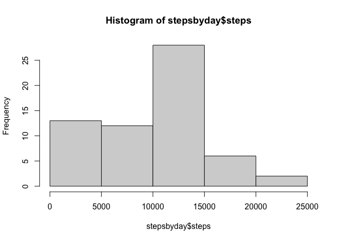
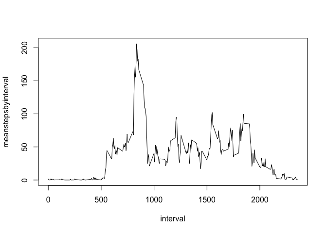
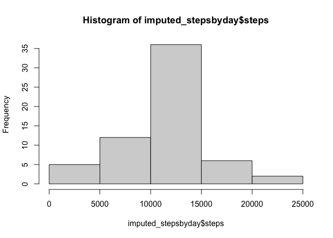
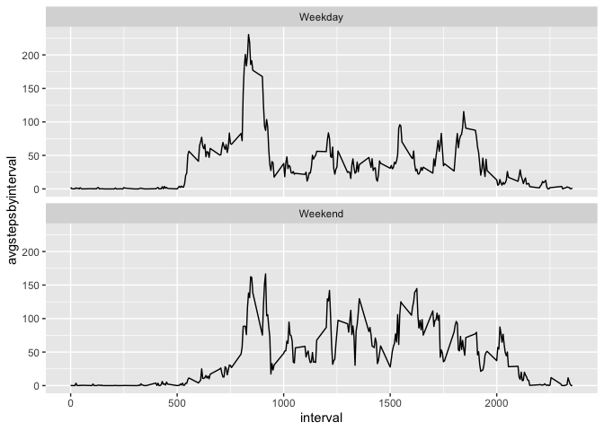

## Loading and preprocessing the data

```r
library(tidyverse)
```

```
## ── Attaching packages ─────────────────────────────────────── tidyverse 1.3.1 ──
```

```
## ✔ ggplot2 3.3.6     ✔ purrr   0.3.4
## ✔ tibble  3.1.7     ✔ dplyr   1.0.9
## ✔ tidyr   1.2.0     ✔ stringr 1.4.0
## ✔ readr   2.1.2     ✔ forcats 0.5.1
```

```
## Warning: package 'ggplot2' was built under R version 4.1.2
```

```
## Warning: package 'tibble' was built under R version 4.1.2
```

```
## Warning: package 'tidyr' was built under R version 4.1.2
```

```
## Warning: package 'readr' was built under R version 4.1.2
```

```
## Warning: package 'purrr' was built under R version 4.1.2
```

```
## Warning: package 'dplyr' was built under R version 4.1.2
```

```
## Warning: package 'stringr' was built under R version 4.1.2
```

```
## ── Conflicts ────────────────────────────────────────── tidyverse_conflicts() ──
## ✖ dplyr::filter() masks stats::filter()
## ✖ dplyr::lag()    masks stats::lag()
```

```r
library(chron)
```

```
## Warning: package 'chron' was built under R version 4.1.2
```

```r
setwd("~/Desktop/RepData_PeerAssessment1")

dat<-read.csv("activity.csv") %>% 
  mutate(date = as.Date(date, format = "%Y-%m-%d"))
```


## Histogram of the total number of steps taken each day

```r
stepsbyday<-dat %>% 
  group_by(date) %>% 
  summarise(steps = sum(steps, na.rm=T))

hist(stepsbyday$steps)
```

<!-- -->


## What is mean and median total number of steps taken per day?

```r
mean_median<-stepsbyday %>% 
  ungroup() %>% 
  summarise(mean_steps = mean(steps),
            median_steps = median(steps))

print(mean_median)
```

```
## # A tibble: 1 × 2
##   mean_steps median_steps
##        <dbl>        <int>
## 1      9354.        10395
```

## Time series plit of the 5-munite interval and avg. number of steps taken


```r
meanstepsbyinterval<-dat %>% 
  group_by(interval) %>% 
  summarise(meanstepsbyinterval = mean(steps, na.rm=T))

with(meanstepsbyinterval, plot(x = interval, y = meanstepsbyinterval, type = "l"))
```

<!-- -->

## The 5-minute interval that, on average, contains the maximum number of steps


```r
meanstepsbyinterval %>% 
  arrange(desc(meanstepsbyinterval)) %>% 
  top_n(1) %>%
  ungroup() %>% 
  select(max_interval = interval, max_step_interval_steps = meanstepsbyinterval)
```

```
## Selecting by meanstepsbyinterval
```

```
## # A tibble: 1 × 2
##   max_interval max_step_interval_steps
##          <int>                   <dbl>
## 1          835                    206.
```


## Calculate and report the total number of missing values in the dataset (i.e. the totalnumber of rows with NAs


```r
table(is.na(dat$steps))
```

```
## 
## FALSE  TRUE 
## 15264  2304
```

## Create a new dataset that is equal to the original dataset but with the missing data filled in.


```r
joined<-dat %>% 
  inner_join(meanstepsbyinterval)
```

```
## Joining, by = "interval"
```

```r
dat_imputed<-joined %>%
  mutate(steps = as.numeric(steps), 
         steps = 
           case_when(
             is.na(steps)~meanstepsbyinterval,
             TRUE~steps)) %>% 
  select(-meanstepsbyinterval) %>%
  as_tibble()

print(dat_imputed)
```

```
## # A tibble: 17,568 × 3
##     steps date       interval
##     <dbl> <date>        <int>
##  1 1.72   2012-10-01        0
##  2 0.340  2012-10-01        5
##  3 0.132  2012-10-01       10
##  4 0.151  2012-10-01       15
##  5 0.0755 2012-10-01       20
##  6 2.09   2012-10-01       25
##  7 0.528  2012-10-01       30
##  8 0.868  2012-10-01       35
##  9 0      2012-10-01       40
## 10 1.47   2012-10-01       45
## # … with 17,558 more rows
```

##Make a histogram of the total number of steps taken each day and Calculate and report the mean and median total number of steps taken per day.

##Histogram of the total number of steps taken each day after missing values are imputed


```r
imputed_stepsbyday<-dat_imputed %>% 
  group_by(date) %>% 
  summarise(steps = sum(steps))


hist(imputed_stepsbyday$steps)
```

<!-- -->

##Calculate and report the mean and median total number of steps taken per day. 

```r
imputed_stepsbyday %>% 
  summarise(mean_stepsbyday = mean(steps), 
            median_stepsbyday = median(steps))
```

```
## # A tibble: 1 × 2
##   mean_stepsbyday median_stepsbyday
##             <dbl>             <dbl>
## 1          10766.            10766.
```


##Do these values differ from the estimates from the first part of the assignment? What is the impact of imputing missing data on the estimates of the total daily number of steps?

The imputed data increases the center of the distribution and decreases the tails. It moves a lot of values from 0 to most common bucket (10000-15000)

## Are there differences in activity patterns between weekdays and weekends?


```r
weekdaysadded<-dat_imputed %>% 
  mutate(weekday = weekdays(date), 
         is_weekend = case_when(
           weekday %in% c("Saturday", "Sunday") ~ "Weekend", 
           TRUE ~ "Weekday"),
         is_weekend = as.factor(is_weekend))

weekdaysummarised<-weekdaysadded %>% 
  group_by(is_weekend, interval) %>% 
  summarise(avgstepsbyinterval = mean(steps))
```

```
## `summarise()` has grouped output by 'is_weekend'. You can override using the
## `.groups` argument.
```

```r
ggplot(weekdaysummarised, aes(x= interval, y = avgstepsbyinterval))+
  geom_line()+
  facet_wrap(~is_weekend, nrow = 2)
```

<!-- -->


